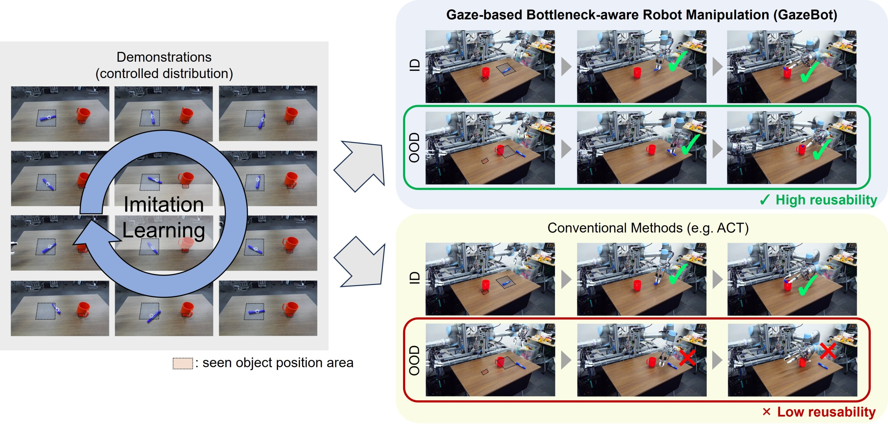

# Enhancing Reusability of Learned Skills for Robot Manipulation via Gaze Information and Motion Bottlenecks
<span style="font-size: 110%;">[Project Page](https://crumbyrobotics.github.io/gazebot/) | [Paper](https://arxiv.org/abs/2502.18121)
<br>
[Ryo Takizawa](https://crumbyrobotics.github.io/), Izumi Karino, Koki Nakagawa, [Yoshiyuki Ohmura](https://www.isi.imi.i.u-tokyo.ac.jp/~ohmura/main.html), [Yasuo Kuniyoshi](https://www.isi.imi.i.u-tokyo.ac.jp/)
<br>
The University of Tokyo
<br>
IEEE Robotics and Automation Letters (RA-L), 2025
</span>



## Installation

- Requires **Python >= 3.9**
- Before installing, please refer to `tong_system/README.md` and install the necessary apt packages for building `ikfastpy`.

**Steps:**
1. Activate your virtual environment (tested with `venv` and `conda`).
2. Run the setup script and follow the prompts:
    ```sh
    ./env_setup.sh
    ```

    > **Note:** When installing `pytorch3d` and `pointops`, ensure your CUDA version matches the one used by your PyTorch installation (check with `nvcc --version`). Also, set the `CUDA_HOME` environment variable to point to your CUDA installation directory. 

> **Note:** If you switch to a different GPU (e.g., change GPU servers), rerunning the setup script is recommended.

---

## Running with Tongsim

1. **Download tongsim:** [https://github.com/crumbyRobotics/tong_simulator](https://github.com/crumbyRobotics/tong_simulator)
2. **[Download model parameters](https://drive.google.com/file/d/12NWEoUUQgzvf7_B3Rhu9OoL04bdz0JL5/view?usp=sharing)**:
    ```sh
    mkdir weights && cd weights
    unzip [your_downloaded_zip_file] -d .
    ```
3. **Launch tongsim (Terminal 1):**
    ```sh
    cd tong_simulator
    python main.py
    ```
4. **Run inference (Terminal 2):**
    ```sh
    python scripts/run.py
    ```

---

## Training (with your demonstration file containing gaze data)
### 0. Create Demonstration Files (PileBox)
You can generate demonstration files for the PileBox task using the `tong_system` test program.  
Both the arm and gaze behaviors are scripted in this case — see [`tong_system/tests/controller.py`](https://github.com/crumbyRobotics/tong_system/blob/master/tests/controller.py) for details.


Launch the simulator (Terminal 1):
```sh
cd tong_simulator
python main.py --sim_device cpu
```
Run the example program (Terminal 2):
```sh
cd tong_system/tests
python test_sim.py
```

### 1. Segment Demonstrations into Sub-tasks

Add `change_steps` data to your `.h5` files.  
- `change_steps` marks the steps where sub-tasks switch (include 0 and the last step).

Example for two sub-tasks (switch at t=80):
```python
with h5py.File(f, "r") as e:
    print(e["change_steps"])  # output: [0, 80, 159]
```
You can annotate manually, but gaze-based task decomposition is recommended for efficiency:  
[https://github.com/crumbyRobotics/GazeTaskDecomp](https://github.com/crumbyRobotics/GazeTaskDecomp)

---

<br>

> **Caution:**  
> Some hyperparameters may need adjustment depending on your robot hardware.  
> Please review the code for optimal performance on your setup.


### 2. Train Gaze Model & LocalBC Model

- Edit config files as needed (e.g., set `agent: gaze` in `config.yaml` for `train_gaze.py`).
- Training progress is tracked with [Weights & Biases](https://wandb.ai/).

Train models:
```sh
python scripts/train_gaze.py # 3~6 hours in A100 GPU
python scripts/train_localbc.py # 5~10 hours in A100 GPU
```
Trained weights are saved in `outputs/yyyy-mm-dd/hh-mm-ss/results`.

Visualization notebooks:
- `notebooks/visualize_gaze.ipynb`
- `notebooks/visualize_localbc_loss.ipynb`

---

### 3. Save LocalBC Loss

The bottleneck step is determined by the action prediction loss of the LocalBC model.

Before training the manipulation model, save the action prediction loss to `.h5` files:

- Edit `localbc_path` in `save_localbc_loss.py`
- Run:
    ```sh
    python scripts/save_localbc_loss.py # ~1 hours 
    ```

---

### 4. Train Manipulation Model

Train the manipulation model:
```sh
python scripts/train_manipulation.py # 10~20 hours in A100 GPU
```


